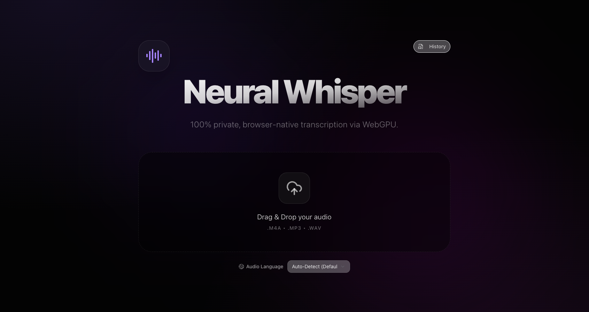
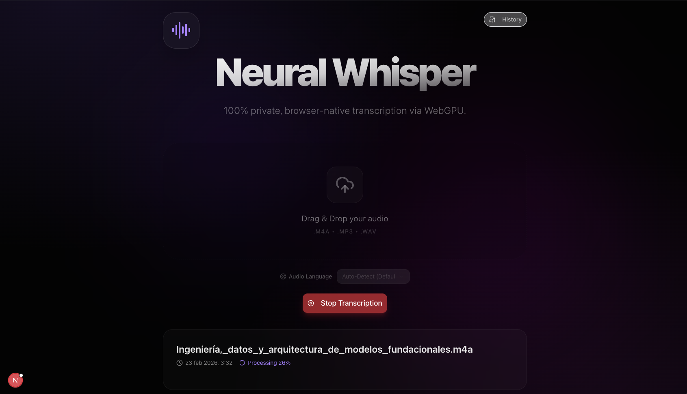
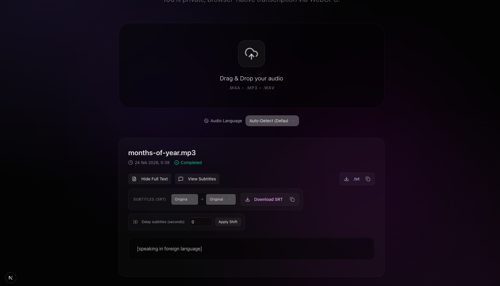
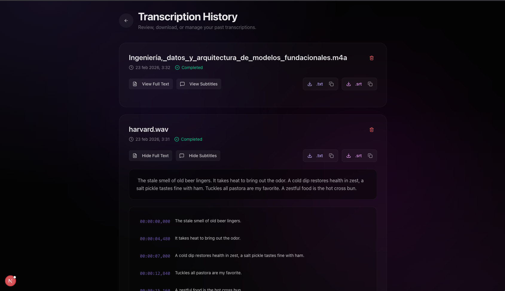

# Neural Whisper (Local Audio Transcriber)

<div align="center">
  
</div>
<div align="center">
  
  
  
</div>

A modern, privacy-first web application built with [Next.js](http://nextjs.org) that allows users to seamlessly drag and drop audio files and receive highly accurate transcriptions in Spanish.

The application leverages a local Web Worker and client-side processing via Transformers.js to ensure efficient, private, and fast transcription directly on your device using WebGPU or WASM.


## Key Features

- 🔒 **100% Private (Local Processing)**: Audio transcription is handled directly in your browser. No data is ever sent to a remote server or API. Fast, secure, and zero server-side costs.
- 🌍 **Language Auto-Detection & Selector**: By default, the app automatically detects the spoken language. You can also explicitly set the language (Spanish, English, French, and 8 more) using the built-in selector for higher accuracy.
- ⚡ **Real-time Progress**: View the transcription status and partial results live while the neural model is processing.
- ⏸️ **Cancellable Jobs**: Safely stop processing large files mid-way using the Stop Transcription button.
- 🗃️ **Persistent History**: Your past transcriptions are automatically saved to `localStorage` so you can review them after refreshing or returning to the app later.
- 🌐 **Subtitle Translation**: Translate your `.srt` subtitles into 10 different target languages entirely client-side using lightweight Web Workers and dynamically downloaded models.
- 💾 **Export & Downloads**: Download your generated transcripts as plain text (`.txt`) or as SubRip Subtitles (`.srt`) out of the box. Both features are available inline and in the History tab.
- 📋 **One-Click Copying**: Easily copy full transcripts or subtitles with integrated clipboard buttons.

## NLP Models

This project strictly adheres to a local-first philosophy. To achieve this within the memory limits of a web browser, we use specific quantized ONNX models via Transformers.js:

- **Transcription:** Uses `Xenova/whisper-tiny` for fast, lightweight english transcription.
- **Translation:** Uses targeted `Xenova/opus-mt-{src}-{tgt}` models from Helsinki-NLP. Instead of loading a massive 600M+ parameter universal translation model (which crashes browsers with 1GB+ KV cache buffers), we dynamically fetch ~75MB models specific _only_ to the source and target language pair you select. These models are cached in your browser's IndexedDB for instant, offline reuse.

## Environment Variables

To enable the raw debug logs interface on the main screen (useful for observing the underlying Web Worker message stream), create a `.env.local` file in the root directory and add the following:

```env
NEXT_PUBLIC_ENABLE_LOGS=true
```

## Tech Stack

- **Framework**: Next.js 14 (App Router)
- **Styling**: Tailwind CSS & shadcn/ui
- **Icons**: Lucide React
- **ML Engine**: Hugging Face Transformers.js (Whisper model)
- **State/Persistence**: React Hooks & LocalStorage

## Getting Started

First, install the dependencies:

```bash
npm install
# or
yarn install
# or
pnpm install
```

Then, run the development server:

```bash
npm run dev
# or
yarn dev
# or
pnpm dev
```

Open [http://localhost:3000](http://localhost:3000) with your browser to see the application.

## Vibe Coding

This project was intentionally built using an AI-assisted development approach, where the architecture, design, and code were **vibe coded with Gemini Pro 3.1**.

## License

This project is open-source and available under the MIT License.
